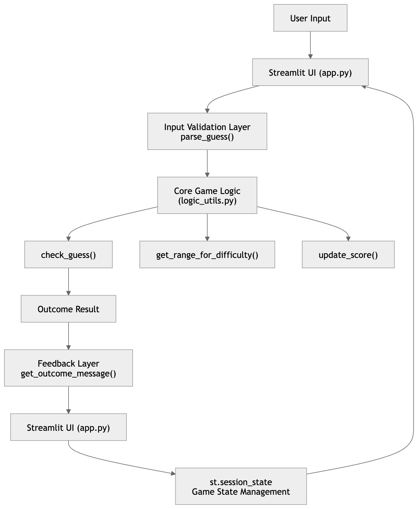
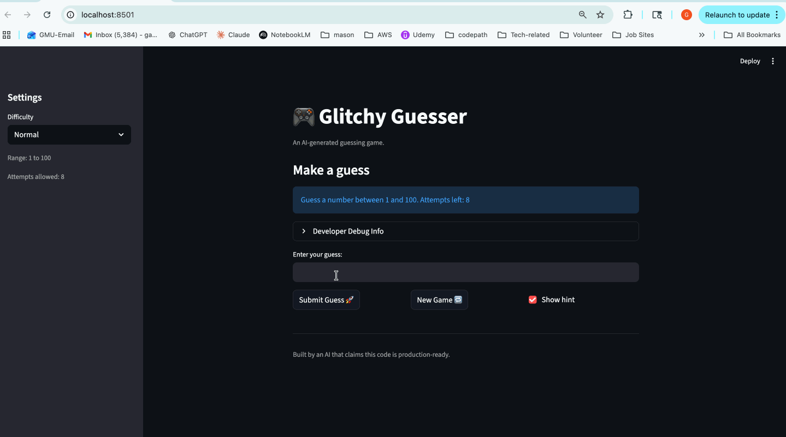

#  Glitchy Guesser (AI Guessing Game)

## Original Project

Glitchy Guesser is a number-guessing game built using Python and Streamlit. In its original version, the project focused on core game logic where the user selects a difficulty level and tries to guess a randomly generated number within a range. The system provides feedback such as “too high” or “too low” until the correct number is found. The goal was to practice modular Python design, user input handling, and separating game logic from the UI layer.

## Title & Summary

Glitchy Guesser - AI-Assisted Interactive Number Guessing Game

Glitchy Guesser is an interactive web-based number guessing game where users attempt to identify a randomly generated hidden number across different difficulty levels. The original version relied purely on rule-based logic for generating numbers, validating guesses, and providing feedback such as “too high” or “too low.”

In the AI-enhanced version, the system goes beyond static game logic by incorporating AI-assisted reasoning to improve feedback clarity, generate more adaptive and user-friendly hints, and better guide the player through the guessing process. 

This project implements a stateful rule-based agent loop where user input is processed through a sequence of deterministic functions for validation, decision-making, scoring, and feedback generation. The system maintains memory using Streamlit session state, enabling persistent interaction across multiple turns.

## Architecture Overview

The system is split into two main components:
1. **Frontend (Streamlit UI - app.py)** 
   - Handles user interaction
   - Displays game state, messages, and inputs
   - Calls backend logic functions
2. **Backend (logic_utils.py)**
   - Contains core game functions:
      - Guess validation (check_guess)
      - Difficulty range selection (get_range_for_difficulty)
      - Score tracking (update_score)
      - Input parsing and messaging

**Data Flow:**
User Input (guess) -> Streamlit UI (app.py) -> parse_guess() (validates input) -> check_guess() (compares with secret) -> update_score() (adjusts score) -> get_outcome_message() (formats feedback) -> st.session_state (stores updated game state) -> UI renders response back to user

While this project does not use machine learning or large language models, it applies AI-inspired design through a layered architecture implemented across the Streamlit UI and backend logic modules.

1. State management layer (UI – app.py):
The application maintains persistent game context using st.session_state, tracking variables such as the secret number, attempts, score, game status, and history. This simulates memory-like behavior across user interactions.

2. Decision logic layer (logic_utils.py):
Core game logic is implemented as stateless functions such as check_guess() and update_score(), which handle deterministic decision-making independently from the UI.

3. Feedback transformation layer (logic_utils.py):
The function get_outcome_message() converts raw system outputs into structured, human-readable responses, simulating adaptive feedback behavior.

Together, these layers form a simplified agent-style pipeline: user input → state-aware processing → rule-based reasoning → contextual response generation.

## Setup Instructions

1. **Clone the repository** 
- git clone https://github.com/your-username/glitchy-guesser.git
- cd glitchy-guesser

2. **Create virtual environment**
- python -m venv venv
- source venv/bin/activate   # Mac/Linux
- venv\Scripts\activate      # Windows

3. **Install dependencies**
- pip install streamlit

4. **Run the application**
- streamlit run app.py

## Sample Interactions

1. **Example 1**
- Input: 
   - Difficulty: Easy
   - Guess: 42
- Output: 
   - "System anomaly: number is higher than your guess."

2. **Example 2**
- Input: 
   - Difficulty: Normal
   - Guess: 73
- Output: 
   - "Glitch detected: number is lower than your guess."

3. **Example 3**
- Input: 
   - Difficulty: Hard
   - Guess: 58
- Output: 
   - "Correct! You cracked the system 🎉"
   - "You won! The secret was 58. Final score: X"

## Demo

## Design Decisions

- **Separation of Logic and UI:**
   - I isolated game logic into a separate module.
- **Streamlit for UI:**
   - Chosen for fast prototyping and clean web interface without needing frontend frameworks.
- **Modular Function Design:**
   - Each function handles a single responsibility (e.g., parsing, scoring, validation).

**Trade-offs**
- Streamlit limits advanced UI customization.

## Testing Summary

- **Test Coverage:**
   - Total tests: 13
   - Result: All tests passed successfully
   - Coverage: Core logic functions (parse_guess, check_guess, update_score, get_outcome_message)
- **What worked:**
   - Core guessing logic performed correctly across difficulty levels.
   - UI updates correctly reflected backend state.
   - Input validation prevented crashes from invalid guesses.
- **What didn't work:**
   - Some edge cases in input parsing (non-numeric input) initially caused errors.
- **What I learned:**
   - Importance of separating UI and logic early.
   - Writing modular Python code improves scalability significantly.

## Reflection

Through building this project, I learned how to structure a small but complete Python application with a clear separation between UI (Streamlit) and backend logic. Breaking the system into modules like app.py and logic_utils.py helped me understand how decoupling components improves maintainability, testing, and debugging. On the technical side, I also learned how to integrate rule-based logic with AI-assisted components in a controlled way—using AI to enhance user feedback and hints without replacing the deterministic core game engine.